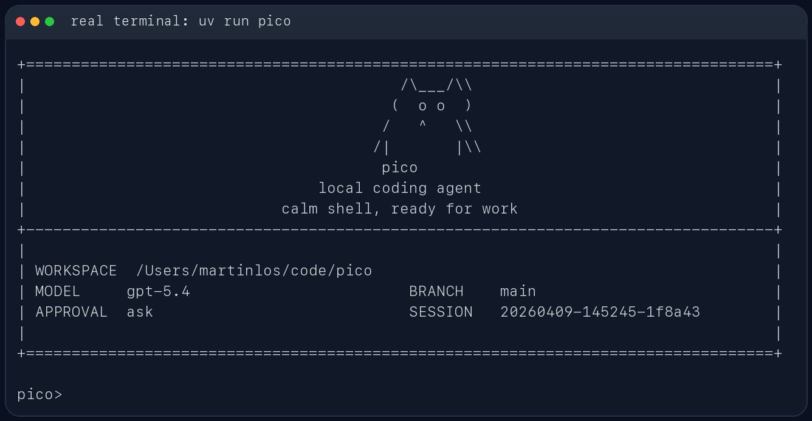

# Pico V2

[](https://github.com/aohodo/picoV2/actions/workflows/ci.yml)

`pico` 是一个受熟练程序员工作机制启发的、证据驱动且具有事务执行边界的本地 Coding Agent Runtime。它把软件开发建模为对“预期程序行为”和“实际运行证据”的持续校准，而不是让模型在一段不断增长的聊天历史里自由调用工具。

Pico 直接运行在终端中，围绕当前目标建立局部代码理解，区分已确认事实和待解决问题，在编辑与运行之间小步推进，并优先解释仍未解决的失败。所有修改先发生在事务型 Shadow 工作区中；只有当前代码、验证结果和交付要求一致时，才进入 Review/Commit。

这个项目不声称复制人类大脑或暴露模型的私有思维链。它借鉴的是熟练程序员可观察的工作策略：目标导向的信息选择、持续更新的局部理解、假设与验证、小步编辑—运行循环、负反馈消解和交付前复核。

## 适合做什么

- 在本地仓库里排查测试失败
- 读取当前代码结构并给出修改建议
- 基于现有文件做小步迭代，而不是脱离仓库空想
- 在会话中保留上下文，支持继续上一次工作

## 主要特性

- 包名是 `pico`
- CLI 命令是 `pico`
- 模块入口是 `python -m pico`
- 通过 `work_focus` 和 evidence frontier 维护当前已知事实、未决问题和下一阶段
- 从用户明确指出的文件构建有修订身份的首轮 source working set
- 支持单文件修改和可回滚的原子跨文件 `apply_patch` 工作单元
- TSW 将编辑、验证、Review 和 Commit 隔离在 Shadow 工作区生命周期内
- 验证失败、代码修订和交付状态由 Runtime 判定，不以模型自述为准
- Working Memory、Durable Memory、Checkpoint 和 Resume 分别承担不同时间尺度的状态
- 会话保存在 `<state-root>/workspaces/<workspace-id>/sessions/`
- 每次运行的工件保存在 `<state-root>/workspaces/<workspace-id>/runs/<run_id>/`
- 支持四类模型后端：
  - Ollama
  - OpenAI 兼容 Responses API
  - Anthropic 兼容 Messages API
  - DeepSeek Anthropic 兼容 API

## 核心设计

Pico V2 的主循环不是“尽可能读完仓库再一次性生成答案”，而是熟练程序员常见的交替推进过程：

```text
目标与约束
  → 建立与当前问题有关的局部理解
  → 识别会影响决策的未决问题
  → 做一次具有区分力的读取、实验或修改
  → 运行并理解结果
  → 用预期与实际的差异更新当前判断
  → 完成工作单元并复核交付
```

Runtime 保存的是支撑下一步判断的工程事实，而不是模型的私有推理过程：源码范围及其修订、调用关系、未验证修改、尚未消解的失败、验证身份、事务状态和用户约束。详细研究依据、架构映射、非目标和评测假设见 [Human-Inspired Programming Loop](docs/architecture/human-inspired-programming-loop.md)。

## 当前验证状态

当前仓库回归为 `207 passed, 1 skipped`。除单元和状态转换测试外，Pico 还使用 Qwen3.8-Flash 在隔离的历史项目副本中执行过真实任务：

| 任务 | 结果 | 观察 |
| --- | --- | --- |
| Python 并发原子保存 | 通过 | 10 个工具步骤，独立 pytest 通过 |
| Java 跨文件角色搜索 | 中断恢复后通过 | 修改 6 个文件，独立 Maven 验证通过 |
| Java/JUnit 小型功能 | 首次运行通过 | 6 个工具步骤，修改范围符合要求 |
| Vue 三文件工具提取 | 通过 | 第 8 步完成跨文件编辑，第 10 步构建通过，14 步结束 |
| LeetCode 239 | 恢复后通过 | 实现、JUnit 和 Maven 验证完成 |

Vue 任务的同任务演进记录显示：原始 Runtime 首次写入发生在第 13 步；仅增加阶段建议并没有改善；加入有修订身份的首轮 working set 后首次写入提前到第 8 步；再加入原子工作单元后，完整任务在 14 个工具步骤内结束。这个结果支持当前设计方向，但仍只是有限案例，不是标准 benchmark 成绩。

当前项目面向人已经拆分好的、可独立验证的工程工作单元。它尚未证明能够无人值守完成大型产品、几十模块重构或完整 SWE-bench，也不把宿主进程执行等同于恶意代码安全沙箱。后续评测将优先使用少量可复现的 Python、Java、前端和算法任务，公开请求、仓库修订、验证命令、轨迹和成本，而不是继续增加功能数量。

## 使用截图

CLI 帮助信息：


启动界面：



REPL 内置命令与会话路径：


## 安装

需要 Python 3.10+。

推荐使用 Conda 创建隔离环境（在项目根目录执行）：

```bash
conda env create -f environment.yml
conda activate pico
```

如果当前 PowerShell 尚未执行过 `conda init powershell`，无需修改全局 Shell
配置，也可以直接运行：

```bash
conda run -n pico pico
```

大型 Python/Java 仓库可以安装可选语言服务增强。基础 AST/导入图始终可用；
该 extra 增加定义、引用等 LSP 语义，并在语言服务不可用时自动降级：

```bash
python -m pip install -e ".[lsp]"
```

如果环境已创建、需要同步当前源码与依赖：

```bash
conda activate pico
python -m pip install -e .
```

## 快速开始

在当前仓库里启动交互模式。需要先在 `.env` 中配置 `PICO_PROVIDER` 和对应 Provider 参数，或者显式传入 `--provider`：

```bash
pico
```

指定另一个工作目录：

```bash
pico --cwd /path/to/repo
```

安装 `lsp` extra 后，`inspect_repository` 会按需启动 Python/Java 语言服务，
同一个 workspace/transaction 内复用进程。若需要排查语言服务问题或只使用
快速静态图，可以传 `--semantic-index off`。

直接跑一次性任务：

```bash
pico "inspect the test failures and propose a fix"
```

如果当前环境已经安装过包，也可以直接这样启动：

```bash
python -m pico
```

## 模型后端

Pico 启动时会读取 `.env`。本地真实 key 放在 `.env`，仓库只保留 `.env.example`。使用 `--cwd` 操作其他仓库时，会先加载目标工作区的 `.env`，再加载启动 Pico 时所在目录的 `.env`；后者具有更高环境优先级。显式 CLI 参数仍然优先于环境配置。

配置优先级是：

```text
显式 CLI 参数
  > Pico 启动目录 .env 的 PICO_* 变量
  > 目标工作区 .env 的 PICO_* 变量
  > 对应旧环境变量
```

Provider 选择的具体顺序是：

```text
--provider > PICO_PROVIDER
```

如果两处都没有配置，Pico 会在任何网络请求发生前给出受控配置错误；它不会静默选择某个云 Provider。可以在 `.env` 中写 `PICO_PROVIDER=openai`、`PICO_PROVIDER=anthropic`、`PICO_PROVIDER=deepseek` 或 `PICO_PROVIDER=ollama`，也可以显式传入对应的 `--provider`。

`.env` 会在构建 Provider client 前加载。模型名和 base URL 可以通过 `--model`、`--base-url` 临时覆盖；API key 只从环境变量读取。除 Ollama 的本地 host/model 默认值外，云 Provider 必须明确配置模型、base URL 和 API key。

本地第一次配置：

```bash
cp .env.example .env
```

然后把要使用的 provider key 填进去。`.env` 已经被 `.gitignore` 忽略，不要提交真实 key。

### DeepSeek 配置示例

DeepSeek 走 Anthropic-compatible Messages API。示例：

```bash
PICO_PROVIDER=deepseek
PICO_DEEPSEEK_API_BASE="https://api.deepseek.com/anthropic"
PICO_DEEPSEEK_API_KEY="your-api-key"
PICO_DEEPSEEK_MODEL="deepseek-v4-pro"
```

配置完成后启动：

```bash
pico
```

如果你需要临时切模型或代理地址，不必改 `.env`，可以直接覆盖：

```bash
pico --model deepseek-v4-pro --base-url https://api.deepseek.com/anthropic
```

DeepSeek 当前走 Anthropic-compatible Messages API，所以 runtime 里复用的是 Anthropic-compatible client；这只影响 HTTP 协议，不影响 CLI 用法。

Pico 当前使用文本编码的工具协议，因此会在 DeepSeek 请求中显式关闭 provider-native thinking，避免思考内容耗尽单步输出预算或产生无法回放的 thinking block。后续如果接入原生工具协议，需要同时实现 thinking block 的完整回放，不能只删除这个开关。

### right.codes 配置示例

right.codes 在 Pico 里有两条可选 provider 路径：

- `--provider openai`：走 OpenAI-compatible `/responses`
- `--provider anthropic`：走 Anthropic-compatible `/messages`

如果 right.codes 给你的是一把共享 key，推荐只填这一项：

```bash
PICO_RIGHT_CODES_API_KEY="your-right-codes-key"
```

然后按需要选择 provider：

```bash
pico --provider openai
pico --provider anthropic
```

如果你想显式区分两条 provider 的 key，也可以分别配置：

```bash
PICO_OPENAI_API_KEY="your-right-codes-key-for-codex"
PICO_ANTHROPIC_API_KEY="your-right-codes-key-for-claude"
```

不要在 `.env` 里写 `PICO_OPENAI_API_KEY=$PICO_RIGHT_CODES_API_KEY` 这种 shell 展开形式；Pico 的 `.env` 解析器只读取字面量，不展开变量引用。要么只写 `PICO_RIGHT_CODES_API_KEY`，要么把 key 字符串分别填到 provider-specific 变量里。

如果请求 right.codes 返回 `API Key额度不足`，说明协议和 endpoint 已经打通，但当前 key 没有可用额度；换一把有额度的 key，或到 right.codes 后台处理额度。

当前 Provider 环境变量：

| provider | base URL | API key | model |
| --- | --- | --- | --- |
| `deepseek` | `PICO_DEEPSEEK_API_BASE`，回退 `DEEPSEEK_API_BASE`，必填 | `PICO_DEEPSEEK_API_KEY`，回退 `DEEPSEEK_API_KEY`，必填 | `PICO_DEEPSEEK_MODEL`，回退 `DEEPSEEK_MODEL`，必填 |
| `openai` | `PICO_OPENAI_API_BASE`，回退 `OPENAI_API_BASE`，必填 | `PICO_OPENAI_API_KEY`，回退 `OPENAI_API_KEY`、`PICO_RIGHT_CODES_API_KEY`、`RIGHT_CODES_API_KEY`，必填 | `PICO_OPENAI_MODEL`，回退 `OPENAI_MODEL`，必填 |
| `anthropic` | `PICO_ANTHROPIC_API_BASE`，回退 `ANTHROPIC_API_BASE`，必填 | `PICO_ANTHROPIC_API_KEY`，回退 `ANTHROPIC_API_KEY`、`PICO_RIGHT_CODES_API_KEY`、`RIGHT_CODES_API_KEY`，必填 | `PICO_ANTHROPIC_MODEL`，回退 `ANTHROPIC_MODEL`，必填 |
| `ollama` | `--host`，默认 `http://127.0.0.1:11434` | 不需要 | `--model`，默认 `qwen3.5:4b` |

如果有额外的敏感环境变量需要从 trace/report 里脱敏，可以用 `PICO_SECRET_ENV_NAMES` 配置逗号分隔的变量名，或启动时重复传 `--secret-env-name NAME`。

### OpenAI 兼容接口

如果要改用 OpenAI-compatible `/responses` 服务，显式传 `--provider openai`：

```bash
pico --provider openai
```

例如使用阿里云百炼兼容网关和 Qwen3.8-Flash：

```bash
PICO_PROVIDER=openai
PICO_OPENAI_API_BASE="https://<WorkspaceId>.cn-beijing.maas.aliyuncs.com/compatible-mode/v1"
PICO_OPENAI_API_KEY="your-api-key"
PICO_OPENAI_MODEL="qwen3.8-flash"
```

例如使用 right.codes 的 Codex endpoint：

```bash
PICO_OPENAI_API_BASE="https://www.right.codes/codex/v1"
PICO_RIGHT_CODES_API_KEY="your-right-codes-key"
PICO_OPENAI_MODEL="gpt-5.4"
```

也可以改成其他 OpenAI-compatible 服务：

```bash
PICO_OPENAI_API_BASE="https://your-api.example/v1"
PICO_OPENAI_API_KEY="your-api-key"
PICO_OPENAI_MODEL="gpt-5.4"
```

### Anthropic 兼容接口

如果要改用 Anthropic-compatible 服务，显式传 `--provider anthropic`：

```bash
pico --provider anthropic
```

例如使用 right.codes 的 Claude endpoint：

```bash
PICO_ANTHROPIC_API_BASE="https://www.right.codes/claude/v1"
PICO_RIGHT_CODES_API_KEY="your-right-codes-key"
PICO_ANTHROPIC_MODEL="claude-sonnet-4-6"
```

如果网关为两种协议复用同一套密钥，可以使用 `PICO_RIGHT_CODES_API_KEY` 或 `RIGHT_CODES_API_KEY`；Pico 不会跨用 OpenAI 和 Anthropic 的 provider-specific key。

### Ollama

如果要改用本地 Ollama，显式传 `--provider ollama`：

```bash
ollama serve
ollama pull qwen3.5:4b
pico --provider ollama --model qwen3.5:4b
```

## 常用交互命令

- `/help`：查看内置命令
- `/memory`：查看提炼后的工作记忆
- `/session`：查看当前会话文件路径
- `/reset`：清空当前会话状态
- `/exit` 或 `/quit`：退出 REPL

## 安全与持久化

`pico` 不会默认把所有动作都放开。像 shell 执行、文件写入这类高风险操作，会受审批模式控制：

- `--approval ask`
- `--approval auto`
- `--approval never`

每次运行结束后，都会在
`<state-root>/workspaces/<workspace-id>/runs/<run_id>/` 下写出这些文件：

- `task_state.json`
- `trace.jsonl`
- `report.json`

这些内容默认只保存在本地，不需要跟仓库一起提交。

Windows 默认的 `<state-root>` 是 `%LOCALAPPDATA%\Pico`；Linux/macOS 使用
`$XDG_STATE_HOME/pico`，未设置时使用 `~/.local/state/pico`。可以通过
`PICO_STATE_ROOT` 显式指定位置；`/session` 会显示当前会话文件的实际路径。

### TSW 与执行环境

TSW 只负责 Shadow 工作区、冲突检查、提交、回滚和恢复，不会在每次任务或
`run_shell` 时启动嵌套 Docker。Shell 命令直接在当前事务的 Shadow 根目录中
执行，且只继承经过筛选的环境变量。生产部署的宿主隔离由 Pico 外层运行环境
负责；直接在宿主机运行 `pico` 属于可信本地模式，不等价于安全沙箱。

如需容器隔离，只构建并启动整个 Pico Runtime：

```powershell
docker build -f docker/Dockerfile.runtime -t pico-runtime:1 .
docker run --rm -it --env-file .env `
  -v "${PWD}:/workspace" `
  -v pico-state:/home/pico/.local/state/pico `
  pico-runtime:1
```

容器启动后，同一 Pico 进程内的所有 TSW 事务复用该部署边界，不需要 Docker-in-Docker。

## 开发

常用本地检查：

```bash
python -m pytest tests -q
python -m ruff check pico tests scripts
```

提交到 `main`、`dev` 或创建 Pull Request 时，GitHub Actions 会在 Windows/Linux 和 Python 3.10/3.12 上执行 CLI smoke、Ruff 与 pytest；CI 不调用真实模型或读取本地 `.env`。

不需要 API Key 的 12 题确定性 Harness 回归可以直接复现：

```bash
python scripts/run_harness_regression.py
```

任务副本和机器可读结果默认写入已忽略的 `artifacts/`。它验证工具边界、恢复、漂移和记忆等 Runtime 机制，不应被解释成真实模型编码能力成绩。

内部代码现在按较轻的边界拆分：`pico/evaluation/` 放 benchmark 和 metrics，`pico/providers/` 放模型 provider client，`pico/features/` 放可选运行时能力。新代码应直接使用这些包路径；旧的 `pico.evaluator`、`pico.metrics`、`pico.models` 和 `pico.memory` import 不再作为公共入口保留。
